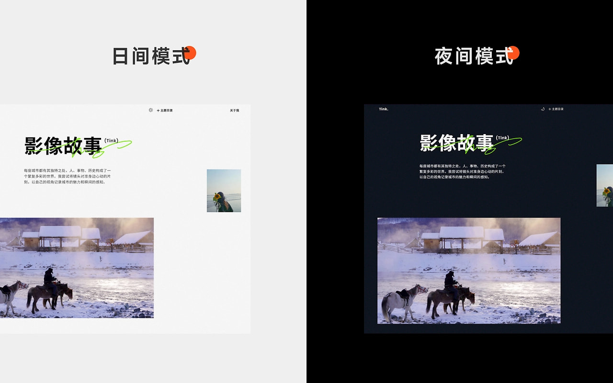

# Tink Photo Gallery

[中文](README.md) | **English**

**Tink's World!**  
Tink's personal website, built with Astro.

A collection of Tink's photography — visual stories of cities, nature, and journeys, along with life notes and a personal introduction.

## What's Inside

- **Photo Gallery**: works organized by theme — nature, city, Altay, Jiuzhaigou, sunset, and more
- **Visual Stories**: travel essays and captured moments
- **About Tink**: personal introduction
- **Blog**: occasional thoughts on life

Live site: [tinks.netlify.app](https://tinks.netlify.app/)



## ✨ Features

- ⚡ Static site powered by Astro — zero JS by default, fast loading
- 🖼️ Galleries organized by theme (Sunset / Nature / City / Moment / Altay special), driven by data config
- 📝 Built-in blog with Markdown content collections
- 🎬 GSAP + Lenis smooth scrolling and animations, Swiper carousels
- 🎨 Sass styling, Sharp image optimization
- 🔧 Site-wide settings centralized in a single config file — change once, applied everywhere

## 🚀 Getting Started

### Requirements

- Node.js `>= 22.12.0`
- [pnpm](https://pnpm.io) recommended (the repo ships with `pnpm-lock.yaml`)

```bash
# If you don't have pnpm yet
npm install -g pnpm
```

### Install & Run

```bash
# Clone the repository
git clone <repository-url>
cd tinks

# Install dependencies
pnpm install

# Start the dev server (default: http://localhost:4321)
pnpm dev
```

### Commands

| Command        | Action                                        |
| :------------- | :-------------------------------------------- |
| `pnpm install` | Install dependencies                          |
| `pnpm dev`     | Start local dev server at `localhost:4321`    |
| `pnpm build`   | Build the production site to `./dist/`        |
| `pnpm preview` | Preview the production build locally          |
| `pnpm check`   | Run Astro type and content checks             |

> `npm run <command>` or `yarn <command>` also work, but stick to pnpm to avoid multiple lockfiles.

## 📂 Project Structure

```
/
├── public/                  # Static assets (favicon, hero images, menu covers)
├── src/
│   ├── assets/              # Images processed at build time
│   ├── components/          # Astro components
│   │   ├── elements/        # Base element components
│   │   ├── gallery/         # Gallery components
│   │   ├── Header.astro     # Site header
│   │   ├── Footer.astro     # Site footer
│   │   └── ...
│   ├── config/
│   │   └── site.ts          # ⭐ Site config (name, SEO, author info, nav, categories)
│   ├── content/
│   │   └── blog/            # Blog posts (Markdown)
│   ├── content.config.ts    # Content collection definitions
│   ├── data/
│   │   └── gallery/         # Gallery data, split by category (sunset/city/nature/...)
│   ├── functions/           # Utility functions
│   ├── layouts/             # Page layouts
│   ├── pages/               # Route pages
│   │   ├── index.astro      # Home
│   │   ├── about.astro      # About
│   │   ├── blog/            # Blog routes
│   │   ├── posts/           # Featured posts
│   │   ├── collection/      # Category gallery pages
│   │   └── 404.astro
│   ├── scripts/             # Client scripts (scrolling, animations)
│   └── styles/              # Global Sass styles
├── astro.config.mjs         # Astro config (with @ path aliases)
├── package.json
└── pnpm-lock.yaml
```

## 🛠️ Customization Guide

### 1. Edit Site Info

All site-level configuration lives in [src/config/site.ts](src/config/site.ts):

- **Basics**: site name, tagline, domain, SEO description
- **Author profile**: avatar, bio, social links (Pexels, Github, Instagram, etc.)
- **Navigation**: `navigationItems`
- **Gallery categories**: `categoryItems` (name, cover image, photo count)

### 2. Add Photos

Gallery data lives in [src/data/gallery/](src/data/gallery/), split into one file per category (e.g. `sunset.ts`, `city.ts`). Add entries following the existing format; type definitions are in [types.ts](src/data/gallery/types.ts).

### 3. Write Blog Posts

Create a Markdown file under [src/content/blog/](src/content/blog/). The template files in that directory (`article-template.md` / `chinese-article-template.md`) are good starting points.

### 4. Adjust Styles

Global styles live in [src/styles/](src/styles/), written in Sass. The path alias `@/` maps to `src/`, and `@/elements` maps to `src/components/elements`.

## 📦 Tech Stack

| Tech | Purpose |
| :--- | :--- |
| [Astro](https://astro.build) | Static site framework |
| [GSAP](https://gsap.com) | Animation |
| [Lenis](https://lenis.darkroom.engineering) | Smooth scrolling |
| [Swiper](https://swiperjs.com) | Carousel |
| [Sass](https://sass-lang.com) | Styling |
| [Sharp](https://sharp.pixelplumbing.com) | Image processing |
| TypeScript | Type checking |

## 📧 Contact

- **Author**: Ricoui
- **Blog**: [ricoui.com](https://ricoui.com)
- **Email**: hello@ricoui.com
- **Twitter**: [@ricouii](https://x.com/ricouii)
- **GitHub**: [@ricocc](https://github.com/ricocc)

## More Templates

- **Starter Template** — open source: [https://github.com/ricocc/ricoui-astro-starter](https://github.com/ricocc/ricoui-astro-starter)

- **SaaS Template** — open source: [https://github.com/ricocc/ricoui-saas-template/](https://github.com/ricocc/ricoui-saas-template/)

- **Portfolio Template** — open source: [https://github.com/ricocc/ricoui-portfolio](https://github.com/ricocc/ricoui-portfolio)

- **Blog Template** — open source: [https://github.com/ricocc/public-portfolio-site](https://github.com/ricocc/public-portfolio-site)

---

## About the Author

I'm Rico, a web/UI designer who loves building fun and creative things. With a background in UI/UX design, I currently focus on web design, visual craft, and development projects.

Feel free to add me on WeChat and say hi:


I write regularly on my blog <a href="https://ricoui.com/" target="_blank">Rico's Blog</a>. You can also follow me on Twitter [@ricouii](https://x.com/ricouii) and Xiaohongshu [@Rico的设计漫想](https://www.xiaohongshu.com/user/profile/5f2b6903000000000101f51f).

## 💜 Support

If this project helps you, a small tip goes a long way in keeping the work going. Thank you!


---

⭐ If you find this project useful, please give it a star!

## 📃 License

This project is open-sourced under the MIT License. See the [LICENSE](LICENSE) file for details.
